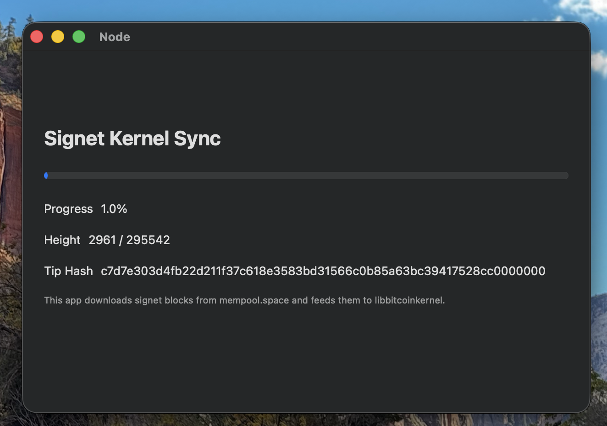

# Node

This project is a SwiftUI proof of concept for feeding signet blocks from mempool.space into [`libbitcoinkernel`](https://github.com/bitcoin/bitcoin/issues/27587).



The Xcode build automatically configures, builds, installs, links, and embeds
the right `libbitcoinkernel` variant for macOS, iPhone Simulator, or iPhone.

## Prerequisites

Install [Homebrew](https://brew.sh) first.

Then install the build tools and the non-IPC dependencies used by the kernel build:

```sh
brew install cmake ninja boost pkgconf
```

Required tools and packages:

- `cmake`
- `ninja`
- `boost`
- `pkgconf`

Optional:

- `ccache` to speed up repeated kernel rebuilds

## Clone Bitcoin Core

Clone upstream [Bitcoin Core](https://github.com/bitcoin/bitcoin) into `bitcoin-core` in this repository root:

```sh
git clone https://github.com/bitcoin/bitcoin.git bitcoin-core
```

If you already have a checkout elsewhere, a symlink also works:

```sh
ln -s /path/to/bitcoin bitcoin-core
```

If `./bitcoin-core` is missing, the Xcode build fails immediately with a clear error.

## Run The App

Open `Node.xcodeproj` in Xcode and build/run the `Node` target.

During the build, Xcode calls [embed-libbitcoinkernel.sh](scripts/embed-libbitcoinkernel.sh), which in turn uses [build-libbitcoinkernel.sh](scripts/build-libbitcoinkernel.sh) to:

- configure a kernel-only Bitcoin Core build for the current platform
- build `libbitcoinkernel`
- install it into Xcode's DerivedData area
- link the app against the matching dylib and embed it into the app bundle's
  `Frameworks` directory

For iPhone builds you will also need normal Xcode signing and provisioning for your device.

Because those kernel build artifacts now live under DerivedData, `Product > Clean Build Folder` also clears the CMake build/install outputs.

## Manual Build

If you want to inspect the Xcode build helpers, see [embed-libbitcoinkernel.sh](scripts/embed-libbitcoinkernel.sh) and [build-libbitcoinkernel.sh](scripts/build-libbitcoinkernel.sh).

Local settings should go in `Config/Node.local.xcconfig`, which is ignored by git and included from the tracked `Config/Node.xcconfig`. Do not commit your personal `DEVELOPMENT_TEAM` or other machine-specific signing overrides to `Node.xcodeproj/project.pbxproj`.

### Local Overrides

Uncomment or add lines in `Config/Node.local.xcconfig` to override build defaults:

| Setting | Effect | Example |
|---------|--------|---------|
| `BITCOIN_CORE_BUILD_TYPE` | CMake build type for `libbitcoinkernel`. Defaults to `Debug`; Xcode Release builds always use `Release`. | `BITCOIN_CORE_BUILD_TYPE = Release` |
| `SWIFT_ACTIVE_COMPILATION_CONDITIONS` | Add `DISABLE_KERNEL_LOGGING` to silence kernel log output. | `SWIFT_ACTIVE_COMPILATION_CONDITIONS = $(inherited) DISABLE_KERNEL_LOGGING` |

### Before Pushing

Run both the normal and logging-disabled variants before pushing changes:

```sh
xcodebuild test -project Node.xcodeproj -scheme Node -destination 'platform=macOS' -only-testing:NodeTests
xcodebuild test -project Node.xcodeproj -scheme Node -destination 'platform=macOS' -only-testing:NodeTests SWIFT_ACTIVE_COMPILATION_CONDITIONS='DISABLE_KERNEL_LOGGING'
xcodebuild build -project Node.xcodeproj -scheme Node -destination 'generic/platform=iOS Simulator' CODE_SIGNING_ALLOWED=NO
xcodebuild build -project Node.xcodeproj -scheme Node -destination 'generic/platform=iOS Simulator' CODE_SIGNING_ALLOWED=NO SWIFT_ACTIVE_COMPILATION_CONDITIONS='DISABLE_KERNEL_LOGGING'
```

## Notes

- This app uses [`mempool.space`](https://mempool.space/signet) as a block source.
- This is not a full P2P node. `libbitcoinkernel` validates and stores blocks, while block download is done externally.
- The `libbitcoinkernel` API is experimental and may change as Bitcoin Core evolves.
